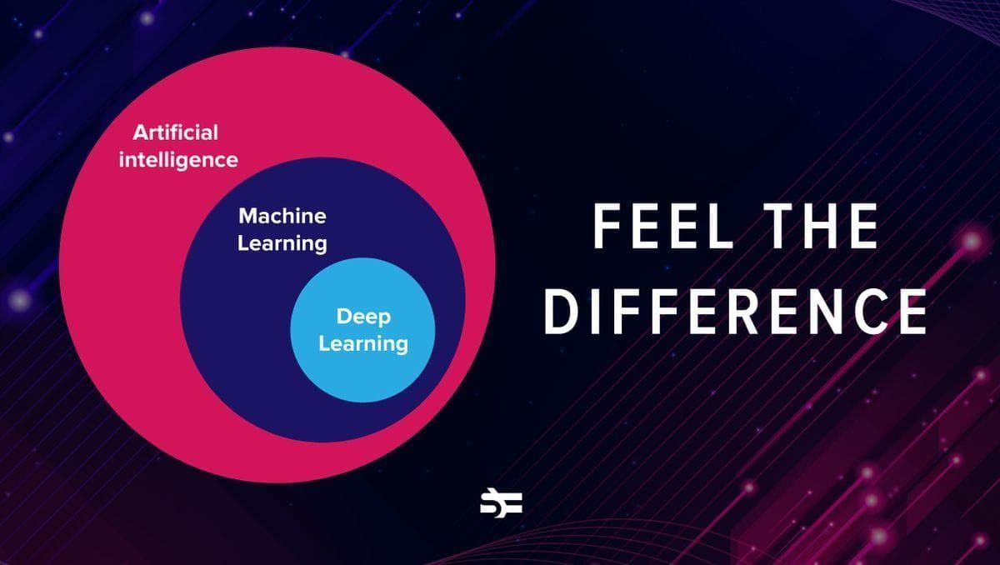

# Machine Learning?
Machine learning (ML) is a subfield of artificial intelligence (AI) that focuses on enabling computers to learn from data and improve their performance on tasks over time without being explicitly programmed for each specific task. Instead of following rigid, predefined instructions, machine learning systems analyze large amounts of data, identify patterns, and make predictions or decisions based on what they have learned from past experiences.
> # Types of Machine Learning

## 1. **Supervised Learning**

   + **Definition:** In supervised learning, the model is trained on a labeled dataset, meaning each input comes with the correct output (label). The goal is for the model to learn the mapping from inputs to outputs so it can predict the label for new, unseen data.

  + **Common algorithms:** Linear regression, logistic regression, support vector machines, decision trees, neural networks.

  + **Examples:** 
  
        1. Email spam detection (emails labeled as “spam” or   “not spam”)

        2. Image classification (images labeled with objects like “cat” or “dog”)

        3. Predicting house prices based on features like size, location, etc.
  

## 2. **Unsupervised Learning**  

 + **Definition:** In unsupervised learning, the model is given data without any labels. The goal is to find hidden patterns, groupings, or structures in the data.

+ **Common algorithms:** K-means clustering, hierarchical clustering, principal component analysis (PCA), autoencoders.
  
 + **Examples:**
  
        1. Customer segmentation in marketing (grouping customers with similar behavior)
   
        2. Anomaly detection (finding unusual patterns in network traffic)
   
        3. Topic modeling in text analysis
  
  
## 3. **Reinforcement**

+ **Definition:** Reinforcement learning involves an agent that learns to make decisions by interacting with an environment. The agent receives feedback in the form of rewards or penalties and aims to maximize cumulative rewards over time.

+ **Key concepts:** Agent, environment, actions, rewards, policy, value function.
  
+ **Examples:**

        1. Training robots to walk or perform tasks

        2. Game playing AI (e.g., AlphaGo, chess engines)

        3. Self-driving cars learning to navigate

> # Difference between AI, ML, and Deep Learning.

## These three are interconnected but distinct fields.

# Artificial intelligence: 

  - Artificial Intelligence (AI) is the broadest term that refers to machines mimicking human intelligence, enabling them to perform tasks like problem-solving, reasoning, learning, and decision-making. AI can be rule-based or data-driven.

# Machine Learning: 

  - Machine Learning (ML) is a subset of AI that focuses on training machines to learn from data without being explicitly programmed. ML algorithms improve over time as they process more information, identifying patterns and making predictions.

# Deep learning:

  - Deep Learning (DL) is a specialized subset of ML that uses neural networks inspired by the human brain. These networks have multiple layers (hence "deep") and are exceptionally good at processing complex patterns, such as image and speech recognition.

Think of it like this: AI is the overall concept, ML is a way to achieve AI, and DL is an advanced technique within ML that handles intricate problems.

